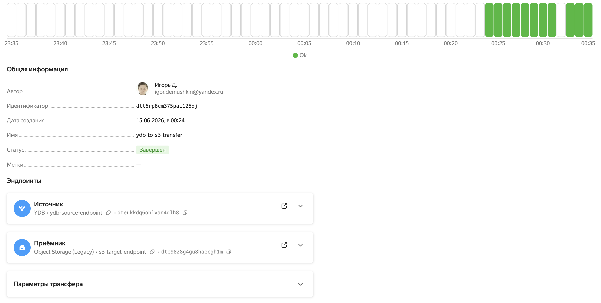
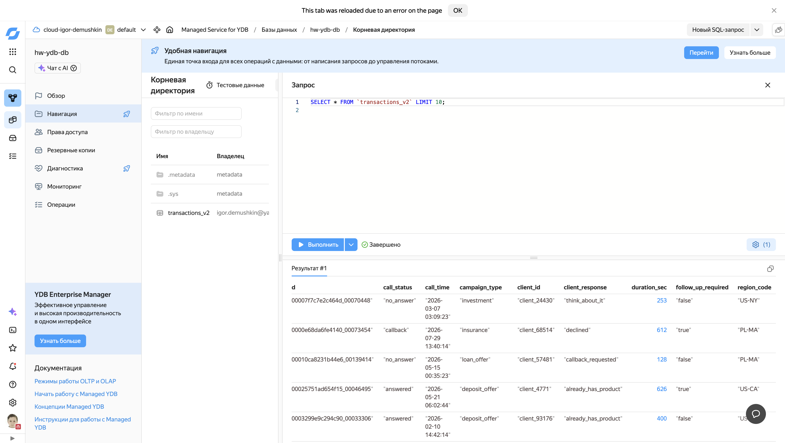

# Домашняя работа: Data Engineering (Фамилия Имя)

## Задание 1. Работа с Yandex DataTransfer (YDB → Object Storage)

### Описание
Перенос данных из Managed Service for YDB в Yandex Object Storage 
с использованием сервиса Data Transfer.

### Данные
Таблица `transactions_v2` — данные о звонках клиентам в рамках 
маркетинговых кампаний.

| Поле | Тип | Описание |
|------|-----|----------|
| call_id | Utf8 | Уникальный ID звонка |
| call_time | Utf8 | Дата и время звонка |
| client_id | Utf8 | ID клиента |
| region_code | Utf8 | Код региона |
| campaign_type | Utf8 | Тип кампании |
| call_status | Utf8 | Статус звонка |
| client_response | Utf8 | Ответ клиента |
| duration_sec | Int32 | Длительность в секундах |
| follow_up_required | Utf8 | Требуется ли повторный контакт |

**Объём данных**: 200 000 записей, выгруженный в Object Storage CSV — 25.79 МБ
(см. `screens/screen1.png`)

### Шаги выполнения

1. Создана YDB Serverless база `hw-ydb-db`
2. Создана таблица `transactions_v2`
3. Загружено 200,000 записей Python-скриптом
4. Создан сервисный аккаунт `data-transfer-sa`
5. Настроены эндпоинты YDB → S3
6. Создан и активирован трансфер `ydb-to-s3-transfer`
7. Данные успешно выгружены в `dataproc-bucket-789/ydb-transfer-output/`

### Результат

### SQL-скрипты
- [Создание таблицы](create_table.sql)
- [Проверка количества записей](1.sql)
- [Просмотр данных](2.sql)
- [Агрегация по регионам](3.sql)

Генераторы данных: [generate_and_upload.py](generate_and_upload.py) (загрузка
в YDB через SDK), [make_random_data.py](make_random_data.py) (генерация
[insert_transactions.yql](insert_transactions.yql)).
