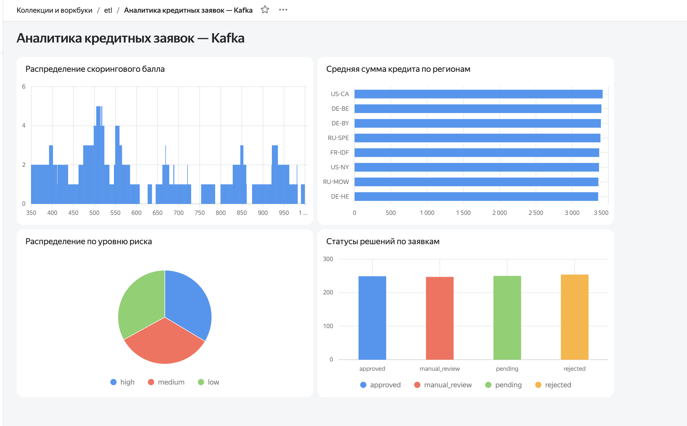

# Задание 4: Визуализация в DataLens

## Источник данных

Данные получены из топика Apache Kafka в рамках Задания 3.  
CSV-файл с 1000 записей загружен из `s3a://dataproc-bucket-789/kafka-flat-output-csv/`  
и подключён к DataLens как источник данных.

## Подключение и датасет

- **Подключение:** `kafka-loans-connection` (тип — File/CSV)
- **Датасет:** `kafka-loans-dataset`
- **Полей в датасете:** 11

## Чарты

| Чарт | Тип | Описание |
|---|---|---|
| Распределение по уровню риска | Круговая диаграмма | Доли low / medium / high |
| Статусы решений по заявкам | Столбчатая диаграмма | Количество по каждому статусу |
| Средняя сумма кредита по регионам | Линейчатая диаграмма | Avg loan_amount по region |
| Распределение скорингового балла | Столбчатая диаграмма | Количество заявок по score |

## Дашборд

Ссылка на дашборд: https://datalens.ru/tc5zaky6uoigc

## Скриншоты

