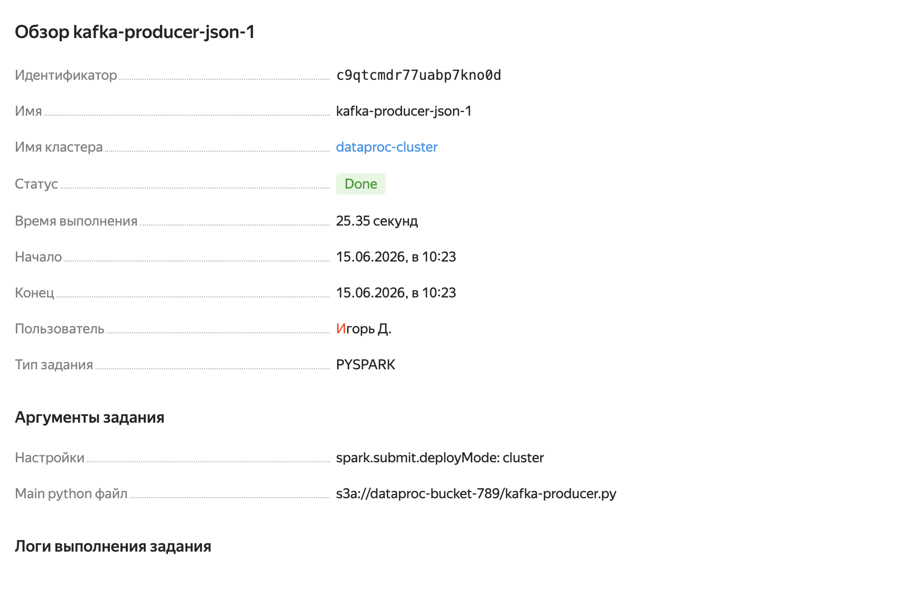
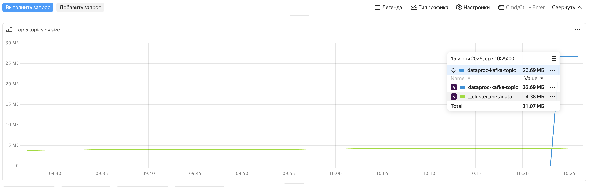
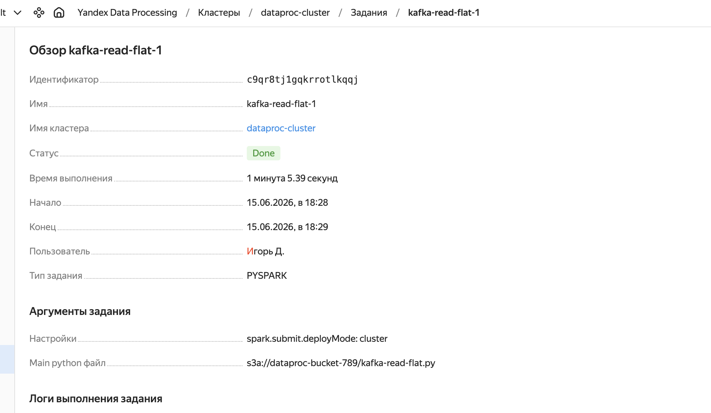
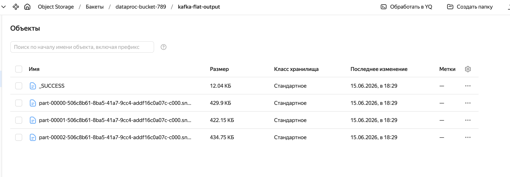
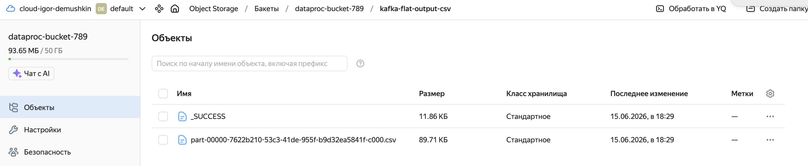
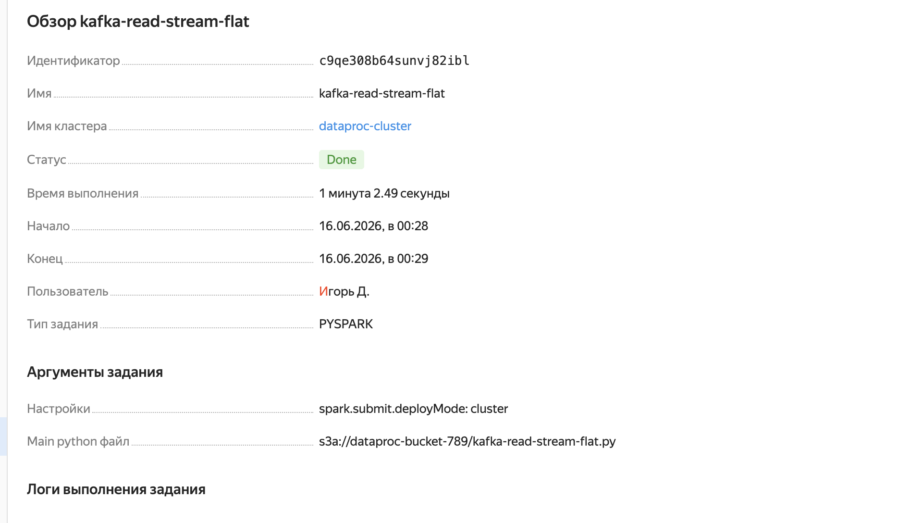
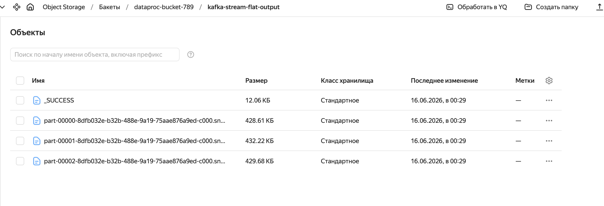

# Задание 3: Работа с топиками Apache Kafka® с помощью PySpark-заданий в Yandex Data Processing

## Архитектура

- **Managed Service for Apache Kafka** (`dataproc-kafka`) — брокер сообщений, топик `dataproc-kafka-topic`
- **Yandex Data Processing** (`dataproc-cluster`) — кластер для выполнения PySpark-заданий
- **Yandex Object Storage** (`dataproc-bucket-789`) — хранение скриптов и результатов
- **Virtual Private Cloud** (`dataproc-network`) — сетевая инфраструктура

## Что сделано

1. Написан PySpark-скрипт `kafka-producer.py` для генерации и отправки **100 000 JSON-сообщений (~30 МБ)** в топик Kafka
2. Реализовано **пакетное чтение** топика (`kafka-read-flat.py`) с разворачиванием вложенного JSON в плоскую таблицу и сохранением в Parquet и CSV
3. Реализовано **потоковое чтение** топика (`kafka-read-stream-flat.py`) с flatten и сохранением результата в Parquet

## Структура репозитория

```
third_task/
├── screens/
│   ├── screen1.png
│   ├── screen2.png
│   ├── screen3.png
│   ├── screen4.png
│   ├── screen5.png
│   └── screen6.png
├── kafka-producer.py
├── kafka-read-flat.py
├── kafka-read-stream-flat.py
└── README.md
```

## Схема данных

### До flatten (JSON в топике Kafka)

```json
{
  "application_id": "loan_784512",
  "customer_id": "cust_441",
  "region": "DE-HE",
  "loan_amount": 15000,
  "term_months": 36,
  "score": 712,
  "risk_level": "medium",
  "doc_type": "passport",
  "doc_status": "verified",
  "decision_status": "manual_review",
  "submitted_at": "2026-05-01T10:15:11Z"
}
```

### После flatten (плоская таблица)

| application_id | customer_id | region | loan_amount | term_months | score | risk_level | doc_type | doc_status | decision_status | submitted_at |
|---|---|---|---|---|---|---|---|---|---|---|
| loan_0 | cust_0 | DE-HE | 1000 | 6 | 350 | low | passport | verified | approved | 2026-05-01T10:15:11Z |
| loan_1 | cust_1 | DE-BY | 1001 | 7 | 351 | medium | passport | pending | rejected | 2026-05-01T10:15:11Z |
| loan_2 | cust_2 | DE-BE | 1002 | 8 | 352 | high | passport | rejected | manual_review | 2026-05-01T10:15:11Z |

## Описание скриптов

### `kafka-producer.py`
Генерирует 100 000 записей в формате JSON и записывает их в топик `dataproc-kafka-topic` через PySpark Structured Streaming API. Использует `when/otherwise` для генерации значений полей. Объём передаваемых данных — **~30 МБ**, что превышает требуемый минимум в 20 МБ.

### `kafka-read-flat.py`
Читает все сообщения из топика пакетным способом (`spark.read`), парсит JSON по заданной схеме через `from_json`, разворачивает вложенную структуру в плоский вид через `.select()`. Результат сохраняется в:
- `s3a://dataproc-bucket-789/kafka-flat-output/` — формат Parquet
- `s3a://dataproc-bucket-789/kafka-flat-output-csv/` — формат CSV (первые 1000 записей)

### `kafka-read-stream-flat.py`
Читает сообщения из топика потоковым способом (`spark.readStream`) с `trigger(once=True)`, применяет flatten и сохраняет результат в:
- `s3a://dataproc-bucket-789/kafka-stream-flat-output/` — формат Parquet

## Результаты

| Задание | Статус | Записей |
|---|---|---|
| `kafka-producer-json` | Done ✅ | 100 000 отправлено |
| `kafka-read-flat` | Done ✅ | 100 000 прочитано и сохранено |
| `kafka-read-stream-flat` | Done ✅ | 100 000 прочитано и сохранено |

## Скриншоты

### 1-е задание


### 2-е задание



### 3-е задание


